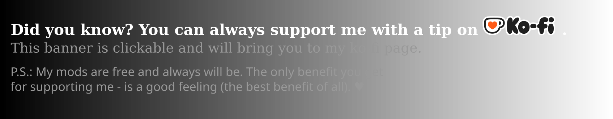

# ✦ Fairer Weapon and Magic Experience Gain

In vanilla Morrowind every cast and every hit teaches the same, so the fastest way to level is a
1-magicka spell or a dagger jab repeated a thousand times. Here experience follows what you actually do:

- **Costly spells teach more.** Fire Bite (6 magicka) teaches as in vanilla, Lightning Storm (34)
  2.3x, anything from 75 magicka up 5x.
- **Slow weapons teach more per hit, fast ones less.** A dagger hit teaches about 0.6x, a long sword
  1.15x, a two-handed axe 1.3x, a bow 1.9x. An attack wound up all the way teaches a third more.
- **Miscasts and misses still teach a little**, exp up to the skill's current level cap but not beyound, you still need to secceed atleast once to receive that skill level up.
- **Using Bound gear also trains Conjuration**, and hits taken under a shield spell train Alteration.

Every number is a setting: Options -> Scripts -> Fairer Weapon and Magic Experience Gain.

 

## ✦ How to install

- **Requires OpenMW 0.51 or newer.**
- Install and enable [Max Yari's Script Services (MSS)](https://www.nexusmods.com/morrowind/mods/60256), it's a required dependency.
- Install this mod **with a mod organiser**: download the archive (or this repository as an archive) and drag and drop it into your mod organiser of choice (e.g [Mod Organizer 2](https://github.com/ModOrganizer2/modorganizer/releases) on Windows or [Nerevarine Organizer](https://github.com/grazelandsnomad/nerevarine_organizer/releases/tag/v0.70) on Linux). **Or** [read this tutorial](https://modding-openmw.com/tips/installing-mods/) on how to install mods using the launcher or completely manually (it's also very easy).
- Enable `FairerWeaponAndMagicXP.omwscripts` in the "Content Files" tab of the OpenMW launcher, after `MaxYariScriptServices.omwscripts`.

Safe to add to or remove from a game in progress.

## ✦ Mod compatibility

Don't combine it with other mods that scale magic or weapon experience (MBSP, Skill Uses Scaled,
NCGDMW's magicka-based progression) - both would scale the same experience. Skill uncappers and
level-up overhauls are fine.

Modders: how it works, and its interface, is in the [technical notes](Sources/DEVELOPMENT.md).
